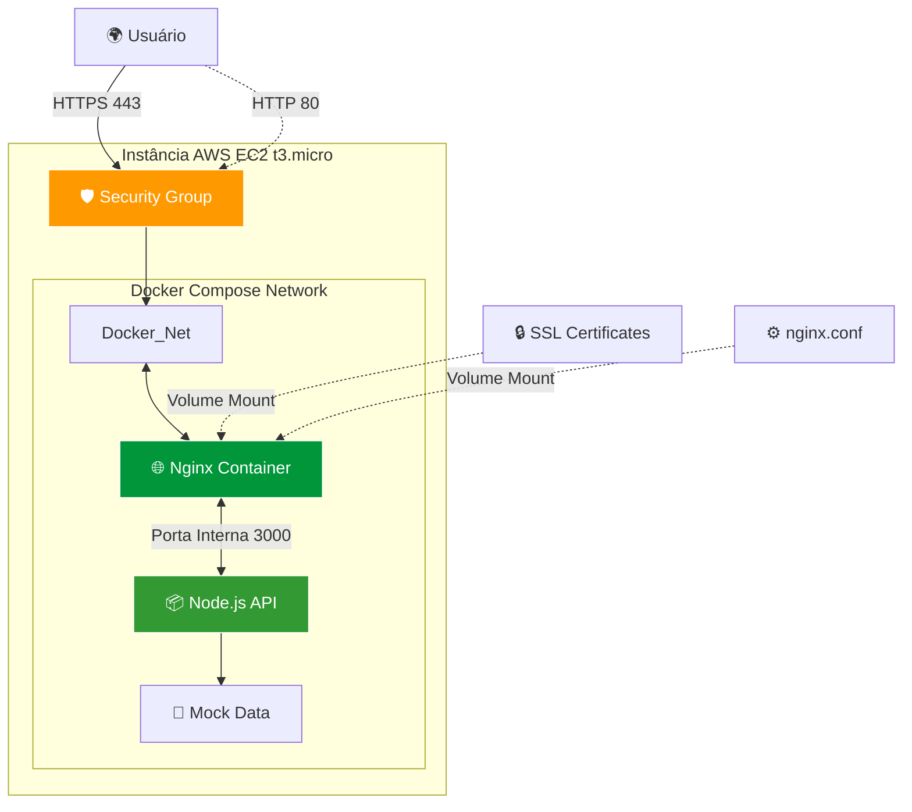
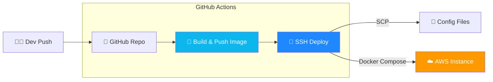

## 🚀 DevOps Challenge

Este projeto consiste em uma API Node.js conteinerizada e implantada em uma infraestrutura profissional na AWS, utilizando Docker Compose, Nginx como Proxy Reverso e um pipeline completo de CI/CD via GitHub Actions.

## 🔗 Links de Acesso
Ambiente de Produção: https://18.222.147.126/status

Ambiente de Staging: https://18.118.159.92/status

⚠️ Nota de Segurança: Devido ao uso de certificados auto-assinados (Self-signed SSL), o navegador exibirá um alerta de segurança. Para acessar, clique em Avançado e Prosseguir. Em produção real, seriam utilizados certificados validados por uma CA (ex: Let's Encrypt).

## 🛠 Arquitetura de Infraestrutura
A solução utiliza uma arquitetura de Proxy Reverso para garantir que a aplicação Node.js nunca seja exposta diretamente à internet, garantindo uma camada extra de segurança e controle de tráfego.

## 🏗 Pipeline CI/CD
O fluxo de automação foi desenhado para garantir deploys seguros, replicáveis e automáticos a cada alteração no código.

## 🔐 Segurança e Boas Práticas
Criptografia em Trânsito: Implementação de HTTPS via Nginx com SSL/TLS (OpenSSL).

Proxy Reverso: Isolamento da porta 3000; a API só aceita conexões vindas do container Nginx.

Gestão de Segredos: Todas as chaves SSH, IPs e credenciais do Docker Hub estão protegidas via GitHub Secrets.

Menor Privilégio: Security Groups da AWS configurados para permitir apenas o tráfego estritamente necessário (22, 80, 443).

## 📊 Observabilidade e Monitoramento
Logs em Tempo Real: Logs estruturados acessíveis via Docker. Para monitorar:

Bash
docker logs -f app-nginx-1
AWS CloudWatch: Acompanhamento de métricas de hardware (CPU, Network e Disk I/O).

Proposta de Alertas: Configuração de alarmes via AWS SNS para notificar via e-mail caso a utilização de CPU ultrapasse 80%.

## 🔄 Estratégia de Rollback
O projeto utiliza Image Tagging baseada no SHA do commit. Em caso de falha:

Acesse a aba Actions no GitHub.

Selecione o último workflow funcional.

Clique em Re-run all jobs.

O sistema fará o rollback para a imagem estável anterior em menos de 1 minuto.

## 🟨 Visão de Integração (Asaas)
A arquitetura foi pensada para facilitar a integração com o ecossistema de pagamentos da Asaas:

Webhooks: O Nginx está preparado para receber notificações de pagamento da Asaas e encaminhar para a API tratar a confirmação de consultas.

Escalabilidade: O uso de Docker Compose permite que a integração seja testada em Staging de forma idêntica à Produção antes do lançamento.