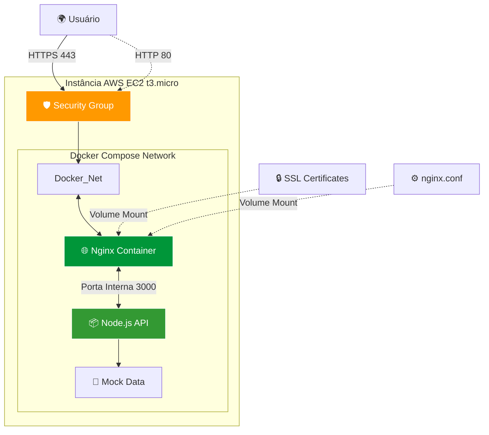
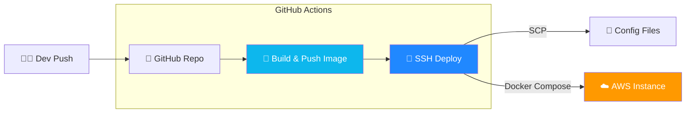

## 🚀 DevOps Challenge

Este projeto consiste em uma API Node.js conteinerizada e implantada em uma infraestrutura profissional na AWS, utilizando Docker Compose, Nginx como Proxy Reverso e um pipeline completo de CI/CD via GitHub Actions.

## 🔗 Links de Acesso
Ambiente de Produção: https://18.222.147.126/status

Ambiente de Staging: https://18.118.159.92/status

⚠️ Nota de Segurança: Devido ao uso de certificados auto-assinados (Self-signed SSL), o navegador exibirá um alerta de segurança. Para acessar, clique em Avançado e Prosseguir. Em produção real, seriam utilizados certificados validados por uma CA (ex: Let's Encrypt).

## 🛠 Arquitetura de Infraestrutura
A solução utiliza uma arquitetura de Proxy Reverso para garantir que a aplicação Node.js nunca seja exposta diretamente à internet, garantindo uma camada extra de segurança e controle de tráfego.

Principais Componentes:
- Instância EC2: Servidor T3.micro hospedando toda a stack.

- Nginx Container: Atua como Proxy Reverso, gerenciando certificados SSL e tráfego HTTPS (porta 443).

- Node.js API: Container isolado na porta interna 3000, acessível apenas pelo Nginx.


```mermaid
graph TD
    User[🌍 Usuário] -->|HTTPS 443| AWS_SG
    User -.->|HTTP 80| AWS_SG

    subgraph AWS_EC2 [Instância AWS EC2 t3.micro]
        direction TB
        AWS_SG[🛡️ Security Group] --> Docker_Net
        
        subgraph Docker_Compose [Docker Compose Network]
            direction LR
            Docker_Net <--> Nginx[🌐 Nginx Container]
            Nginx <-->|Porta Interna 3000| API[📦 Node.js API]
            API --> DB[💾 Mock Data]
        end
    end
    
    Certs[🔒 SSL Certificates] -.->|Volume Mount| Nginx
    Conf[⚙️ nginx.conf] -.->|Volume Mount| Nginx

    style AWS_SG fill:#f90,stroke:#fff,color:#fff
    style Nginx fill:#009639,stroke:#fff,color:#fff
    style API fill:#339933,stroke:#fff,color:#fff
```

## 🏗 Pipeline de CI/CD Modularizado

O fluxo de automação foi desenhado para garantir deploys seguros, replicáveis e automáticos a cada alteração no código.

Paridade de Ambientes: Diferente de pipelines lineares simples, esta solução utiliza Workflows Independentes para Staging e Produção, como demonstrado na organização dos arquivos abaixo:

Fluxo Detalhado:
1. Validação Automática (CI): Todo push dispara a execução de Linting (ESLint) e Testes Unitários (Jest). O deploy é bloqueado se houver falha.

2. SSH Deploy (CD): O pipeline se conecta com segurança ao servidor AWS, garantindo que o deploy seja concluído com sucesso.


```mermaid
graph LR
    Dev[👨‍💻 Dev Push] --> GitHub[🐙 GitHub Repo]
    
    subgraph Pipeline [GitHub Actions]
        GitHub --> Build[🐳 Build & Push Image]
        Build --> Deploy[🚀 SSH Deploy]
    end
    
    Deploy -->|SCP| Configs[📁 Config Files]
    Deploy -->|Docker Compose| EC2[☁️ AWS Instance]
    
    style Build fill:#0db7ed,color:#fff
    style Deploy fill:#2088ff,color:#fff
    style EC2 fill:#f90,color:#fff
```

## 🔐 Segurança e Boas Práticas
- Proxy Reverso (Nginx): A aplicação Node.js está isolada na porta 3000, acessível apenas internamente pelo Nginx via TLS/SSL.

- Hardening de Imagem: Uso de imagens Alpine (Node-Alpine), reduzindo a superfície de ataque e otimizando o tempo de build/transferência.

- Segredos: Gestão rigorosa de credenciais via GitHub Secrets.

- Least Privilege: Security Groups da AWS configurados para tráfego mínimo necessário.

## 📊 Observabilidade e Monitoramento
Logs em Tempo Real: Logs estruturados acessíveis via Docker. Para monitorar:

```
docker logs -f app-nginx-1
```

- AWS CloudWatch: Acompanhamento de métricas de hardware (CPU, Network e Disk I/O).

- Proposta de Alertas: Configuração de alarmes via AWS SNS para notificar via e-mail caso a utilização de CPU ultrapasse 80%.

## 🔄 Estratégia de Rollback
O processo de recuperação de desastres foi fortalecido através de Imutabilidade de Imagens:

- Cada deploy gera uma tag única baseada no Commit SHA (lacrei-api:${{ github.sha }}).

- Rollback Rápido: Diferente de depender apenas da tag latest, agora pode-se reverter para qualquer versão anterior estável em segundos, garantindo um processo claro, seguro e reproduzível.

## 🟨 Visão de Integração (Asaas)
- A arquitetura foi pensada para facilitar a integração com o ecossistema de pagamentos da Asaas:

- Webhooks: O Nginx está preparado para receber notificações de pagamento da Asaas e encaminhar para a API tratar a confirmação de consultas.

- Escalabilidade: O uso de Docker Compose permite que a integração seja testada em Staging de forma idêntica à Produção antes do lançamento.

## 🛠️ Comandos Úteis
Verificar logs em tempo real:

```
docker logs -f devops-deploy-app-1
```
Verificar status de saúde do container:


```
docker inspect --format='{{json .State.Health.Status}}' devops-deploy-app-1
```